# 可编程系统设计复习提纲 2026

> 说明：原 LaTeX 文档中标红的新增/补充内容，在本 Markdown 文档中用 `<span style="color:red">...</span>` 或 **🔴 原文标红：** 标记。

# 电子系统与 PCB 知识点

## 1、电子系统的定义

将由电子元器件或部件组成的能够产生、传输、采集或处理电信号及信息的客观实体称为电子系统。

## 2、电子系统举例

电源系统、通信系统、雷达系统、计算机系统、电子测量系统、自动控制系统等。

## 3、电子系统的基本构成

机箱、外壳、电源、输入、输出接口、连接线缆、信号处理单元（电路板）、模组、部件、外设。

## 4、印制线路板

印制线路板简称印制板，英文为 Printed Circuit Board，缩写为 PCB。

## 5、印制电路概念

印制电路概念于 1936 年由英国 Eisler 博士提出，首创了铜箔腐蚀法工艺。

## 6、PCB 发展

1953 年出现了双面板，并采用电镀工艺使两面导线互连；1960 年出现了多层板；1990 年出现了积层多层板。

## 7、PCB 分类

1. 按用途分：民用、工业、军事。
2. 按材质分：有机材质（酚醛树脂、玻璃纤维/环氧树脂、聚酰亚胺、BT/Epoxy）、无机材质（铝、陶瓷）。
3. 按结构分：单面板、双面板、多层板。
4. 按硬度性能分：硬板、软板、软硬结合板。
5. 按孔的导通状态分：埋孔板、盲孔板、通孔板。
6. 按表面制作分：喷锡板、镀金板、沉金板、金手指板、沉锡板、沉银板。

## 8、常用 FR-4 覆铜板组成

玻璃纤维布、环氧树脂、铜箔、填料。

## 9、多层 PCB 板的生产工艺流程

开料 $\rightarrow$ 内层图形 $\rightarrow$ 层压 $\rightarrow$ 钻孔 $\rightarrow$ 电镀 $\rightarrow$ 外层 $\rightarrow$ 阻焊 $\rightarrow$ 表面处理 $\rightarrow$ 成型 $\rightarrow$ 电测试 $\rightarrow$ FQC $\rightarrow$ FQA $\rightarrow$ 包装 $\rightarrow$ 成品出厂。

## 10、PCB 常用术语

1. 元件面：安装元件的面，大多数元器件都安装在朝上的一面。
2. 焊接面：与元件面相对的那一面。
3. 丝印层：印刷元器件标号、名称等字符的印刷层。
4. 阻焊图：为防止不需要焊接的印刷导线被焊接而绘制的一种图形，制板过程中在此涂一层阻焊剂。
5. 焊盘：用于连接和焊接元件的一种导电图形。
6. 金属化孔：也称为“通孔”，孔壁沉积有金属，用于层间导电图形的连接。

## 11、电路板主要工作层面

信号层、内部电源/接地层、机械层、防护层、丝印层。

## 12、PCB 布局原则

1. 根据结构图设置板框尺寸，按结构要素布置安装孔、接插件等需要定位的器件，并赋予不可移动属性；按工艺设计规范进行尺寸标注。
2. 根据结构图和生产加工时所需的夹持边设置印制板的禁止布线区、禁止布局区域；根据某些元件的特殊要求设置禁止布线区。
3. 遵照“先大后小，先难后易”的布置原则，重要单元电路、核心元器件应优先布局。
4. 布局中应参考原理框图，根据单板的主信号流向规律安排主要元器件。
5. 布局应尽量满足以下要求：
   1. 总的连线尽可能短，关键信号线最短；
   2. 高电压、大电流信号与小电流、低电压弱信号完全分开；
   3. 模拟信号与数字信号分开；
   4. 高频信号与低频信号分开；
   5. 高频元器件的间隔要充分。
6. 相同结构电路部分尽可能采用“对称式”标准布局。
7. 按照均匀分布、重心平衡、版面美观的标准优化布局。
8. 同类型插装元器件在 X 或 Y 方向上应朝一个方向放置。
9. 发热元件一般应均匀分布，以利于单板和整机散热；除温度检测元件外，温度敏感器件应远离发热量大的元器件。
10. 元器件排列要便于调试和维修，小元件周围不能放置大元件，需调试的元器件周围要有足够空间。
11. 去耦电容的布局要尽量靠近芯片电源管脚，并使其与电源和地之间形成的回路最短。
12. 元件布局时，应适当考虑使用同一种电源的器件尽量放在一起，以便于将来的电源分隔。
13. 用于阻抗匹配目的的电阻、电容器件要根据属性合理布置。串联匹配电阻靠近信号驱动端，负载匹配电阻靠近信号接收端。
14. <span style="color:red">数字电流不应流经模拟器件，高速电流不应流经低速器件。</span>

## 13、PCB 的布线原则

1. 首先应对电源线和地线进行布线，以保证电路板的电气性能；尽量加宽电源、地线宽度。
2. 对要求比较严格的线（如高频线）要优先进行布线。
3. 输入端与输出端的边线应避免相邻平行，以免产生反射干扰。
4. 两相邻层的布线要互相垂直，平行容易产生寄生耦合。
5. 必要时应在信号线之间加地线隔离。
6. 振荡器外壳接地。
7. 时钟线要尽量短。
8. 时钟振荡电路下面、特殊高速逻辑电路下面要加大地的面积，不应走其他信号线。
9. 转角处采用 $45^\circ$ 折线或弧线布线，不可使用 $90^\circ$ 折线，以减小高频信号辐射和波形畸变。
10. 信号线不要形成环路；如不可避免，环路应尽量小。
11. 信号线的过孔要尽量少。
12. 关键的线尽量短，并在两边加上保护地。
13. 关键的信号线要依据传输线的特性阻抗模型来设计线宽、线间距。
14. 重要的模拟、高频信号可考虑用线缆连接。
15. 关键信号应预留测试点，以方便生产和维修检测。
16. 差分线要等长。
17. <span style="color:red">布线完成后应进行优化；经初步网络检查和 DRC 检查无误后，对未布线区域进行地线填充，用大面积铜层作地线，或做成多层板，使电源、地线各占用一层。</span>

## 14、开关电源和线性电源各自的主要特点是什么？

1. 开关电源：效率高、功率大、输出电源调整灵活；噪声纹波大。
2. 线性电源：效率低、功率有限；噪声纹波小。

## 15、如果系统中同时存在数字电源和模拟电源，在系统设计时应如何考虑？

<span style="color:red">数字电源和模拟电源应分开设计；多电源系统需独立规划，并综合考虑电源功耗、电源噪声干扰来源以及线性电源、开关电源的特点。</span>

## 16、电子系统为什么要接地？

1. 防止电力、电子设备和建筑物遭雷击，将雷击电流通过避雷针引入大地，从而起到保护作用。
2. 接地是保护人身安全的有效手段，可防止相线与设备外壳碰触时外壳产生危险电压。
3. 电子通信和其他数字领域中，设备之间信号互连要求各设备都要有一个基准“地”作为信号参考地。
4. 解决信号之间互扰等电磁兼容问题，接地不当会影响系统运行的可靠性和稳定性。

## 17、如果系统同时存在数字地和模拟地，在 PCB 设计中应如何处理？为什么？

1. 模拟信号和数字信号都要回流到地。
2. 数字信号能量高、频谱宽，在数字地上引起的噪声大。
3. 模拟地和数字地混在一起时，数字噪声会影响模拟信号。
4. 模拟地和数字地要分开处理，单点接在一起。
5. 尽量阻隔数字地上的噪声进入模拟地。

# FPGA 知识点

## 1、叙述 FPGA 内部的主要构成单元，说明各单元内部的电路功能。说明 FPGA 的工作原理。

1. CLB。
2. IOB。
3. 连接资源（短线、长线、时钟网络、直接连接）。
4. 硬核（块存储、乘法器、时钟管理等）。

## 2、集成电路层次化设计包含哪几层？

1. 系统层。
2. 算法层。
3. 寄存器传输层。
4. 逻辑层。
5. 电路层。
6. 版图层。

## 3、FPGA 设计输入有哪些方式？各自的特点是什么？

**🔴 原文标红：**

FPGA 设计输入（描述）方式主要包括图形描述方式、文字描述方式以及图形、文字交叉使用三类。

1. 图形描述方式
   - 适合描述器件内部互联关系。
   - 可直观描述整体层次关系、输入/输出端口和信号输入/输出关系。
   - 包括方框图、原理图、状态图、时序波形图等。
   - 优点：直观易懂。
   - 缺点：受工艺库、逻辑宏单元限制，通用性和可移植性差。
2. 文字描述方式
   - 可以描述电路结构，也可以描述电路行为。
   - 适合描述复杂行为。
   - 包括自然语言描述、网表、硬件描述语言等。
   - 硬件描述语言（HDL）采用最多，主要有 VHDL 和 Verilog HDL 两种。
3. 图形、文字交叉使用
   - 文字方式适合描述行为，特别是复杂行为。
   - 图形方式适合描述器件内部互连关系，即描述结构。
   - 大规模系统设计中常将文字描述方式和图形描述方式交叉使用。

## 4、画出 FPGA 设计自顶向下的流程图。

**🔴 原文标红：**

FPGA 设计采用自顶向下（Top-Down）的层次化设计流程，如图所示。主要流程为：系统层确定系统设计的功能和指标；算法层进行系统分析并确定系统设计规范、行为级模型和系统时序；寄存器传输层进行设计输入和 RTL 级模型建立，完成可综合 HDL 代码、原理图等设计并进行系统功能仿真；逻辑、电路层进行逻辑综合和可测性设计，生成门级网表和测试图形，并进行时序分析、功耗优化和形式验证；后端进行版图预布局布线、时钟树建立、版图设计、参数提取、时序验证、形式验证和版图验证，最终完成系统版图数据提交（Tape out）。

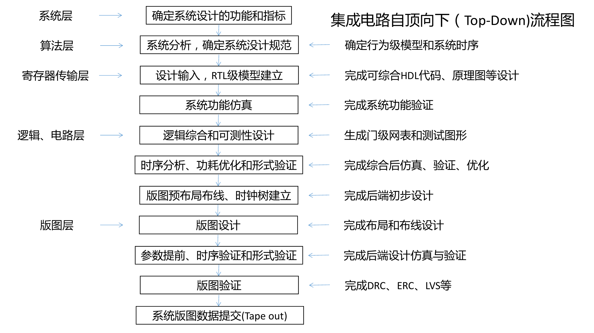

*图：集成电路自顶向下（Top-Down）流程图*

## 5、什么是集成电路设计输入的图形描述方式？有什么特点？

1. 直观描述整体层次关系、输入/输出端口、信号输入/输出关系。
2. 包括方框图、原理图、状态图、时序波形图。
3. 直观易懂。
4. 受工艺库、逻辑宏单元限制。
5. 通用性、可移植性差。

## 6、什么是集成电路设计输入的语言描述方式？有什么特点？

1. 可以描述电路结构，也可以描述电路行为，适合描述复杂行为。
2. 包括自然语言描述、网表、硬件语言描述等。
3. 硬件描述语言（Hardware Description Language, HDL）采用最多。
4. HDL 语言主要有 VHDL 和 Verilog HDL 两种。

## 7、什么是集成电路设计仿真？

1. 利用仿真工具软件对设计的行为进行模拟。
2. 系统层仿真。
3. 电路层仿真。
4. 寄存器传输层仿真。

## 8、什么是集成电路设计验证中的逻辑仿真？

1. 利用计算机软件工具构造硬件模型，给定输入激励，模拟确定电路响应，验证硬件设计正确性的过程。
2. 逻辑仿真可分为不同层次或级别：功能块级仿真、逻辑门级仿真、开关级仿真。

## 9、什么是动态时序仿真？有什么优缺点？

1. 动态时序仿真：对逻辑综合后的网表，或者布局布线后的版图中所产生的网表，施加测试激励，模拟电路工作环境，对电路进行仿真，是传统的时序仿真方法。
2. 动态时序仿真需要对电路施加特定测试激励来验证设计，将功能仿真和时序仿真同时进行，时序分析结果较精确。
3. 对大规模集成电路，创建时序测试向量和功能测试向量的工作量巨大，耗时。
4. 不可能开发出完备测试向量，找出所有潜在故障。

## 10、什么是静态时序分析？静态时序分析的基本步骤是什么？

1. 静态时序分析（Static Timing Analysis, STA）是基于路径对设计进行时序分析。
2. 静态时序分析基本步骤：
   1. 根据电路网表的拓扑将设计分成若干路径集合（路径包括时序单元、门级单元、传输线等）。
   2. 计算每一条路径上的延时（如建立时间、保持时间、传输延时等）。
   3. 对电路时序进行判断，衡量电路性能。

## 11、静态时序分析有哪些优缺点？

1. 静态时序分析优点：
   1. 无需外加测试激励，运行速度快，占用内存小。
   2. 与电路输入激励无关，方便对大规模集成电路进行时序验证。
   3. 可以找到设计中的关键路径，决定最高工作频率。
   4. 可以穷尽所有路径的时序信息，相比动态时序仿真有更强的完备性。
   5. 可识别更多时序故障，如建立/保持、恢复/移除、最小和最大跳变、时钟脉冲宽度和时钟畸变、门级时钟瞬时脉冲检测、总线竞争与总线悬浮错误、不受约束的逻辑通道等。
2. 静态时序分析缺点：
   1. 不能同时进行功能仿真。
   2. 仅适用于同步时序电路。

## 12、如何进行动态时序仿真？

1. 对逻辑综合后的网表，或者布局布线后的版图中所产生的网表，施加测试激励，模拟电路工作环境并进行仿真。
2. 通过特定测试激励验证设计，将功能仿真和时序仿真同时进行，得到较精确的时序分析结果。

## 13、如何进行静态时序分析？

1. 根据电路网表拓扑将设计分成若干路径集合（路径包括时序单元、门级单元、传输线等）。
2. 计算每一条路径上的延时（如建立时间、保持时间、传输延时等）。
3. 对电路时序进行判断，衡量电路性能。

## 14、画图说明什么是建立时间？

建立时间 setup time：指在时钟有效沿（下图为上升沿）之前，数据输入端信号必须保持稳定的最短时间。

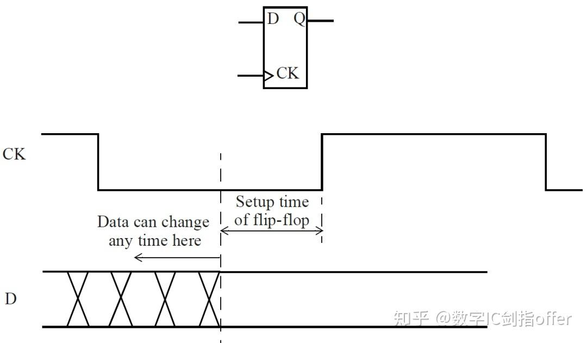

*图：建立时间（setup time）示意图*

## 15、画图说明什么是保持时间？

保持时间 hold time：是指在时钟有效沿（下图为上升沿）之后，数据输入端信号必须保持稳定的最短时间。

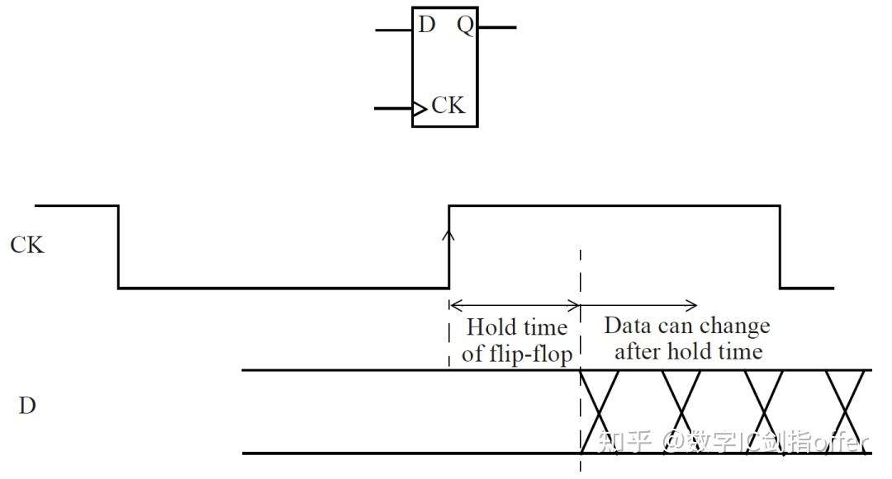

*图：保持时间（hold time）示意图*

## 16、画图说明在静态时序分析时需要考虑哪些时间延迟关系？这些时间延迟是如何产生的？

**🔴 原文标红：**

1. 需要考虑的对象
   - 发送触发器（Launch flip-flop）到接收/捕获触发器（Capture flip-flop）之间的时钟路径。
   - 从发送触发器输出端到接收触发器输入端之间的数据路径。
   - 接收触发器本身的建立时间和保持时间约束。
2. 路径关系
   - 发送路径：时钟到达发送触发器 $\mathrm{UFF0/CK}$，数据经 $\mathrm{UFF0/Q}$ 输出后，通过组合逻辑 $\mathrm{Comb\_logic}$ 到达 $\mathrm{UFF1/D}$。
   - 捕获路径：$\mathrm{CLKM}\rightarrow \mathrm{BUF(capture)}\rightarrow \mathrm{UFF1/CK}$。
3. 建立时间（setup time）分析
   - 数据到达时间：$T_a=T_{launch}+T_{ck2q}+T_{dp}$。
   - 要求时间：$T_r=T_{capture}+T_{clk}-T_{setup}$。
   - 建立时间约束：$T_r-T_a=T_{margin}\ge 0$。
4. 保持时间（hold time）分析
   - 数据到达时间：$T_a=T_{launch}+T_{ck2q}+T_{dp}$。
   - 要求时间：$T_r=T_{capture}+T_{hold}$。
   - 保持时间约束：$T_a-T_r=T_{margin}\ge 0$。
   - 等价表示：$T_{launch}+T_{ck2q}+T_{dp}=T_{capture}+T_{hold}+T_{margin}$。
5. 各延迟的产生原因
   - $T_{launch}$、$T_{capture}$：由时钟网络缓冲器和连线延迟产生。
   - $T_{ck2q}$：触发器 CK 到 Q 的传输时间，由触发器内部电路延迟产生。
   - $T_{dp}$：组合逻辑延时，由门电路延迟和互连线延迟产生。
   - $T_{setup}$、$T_{hold}$：接收触发器内部电路的固有时序要求。
   - $T_{margin}$：设计裕量。

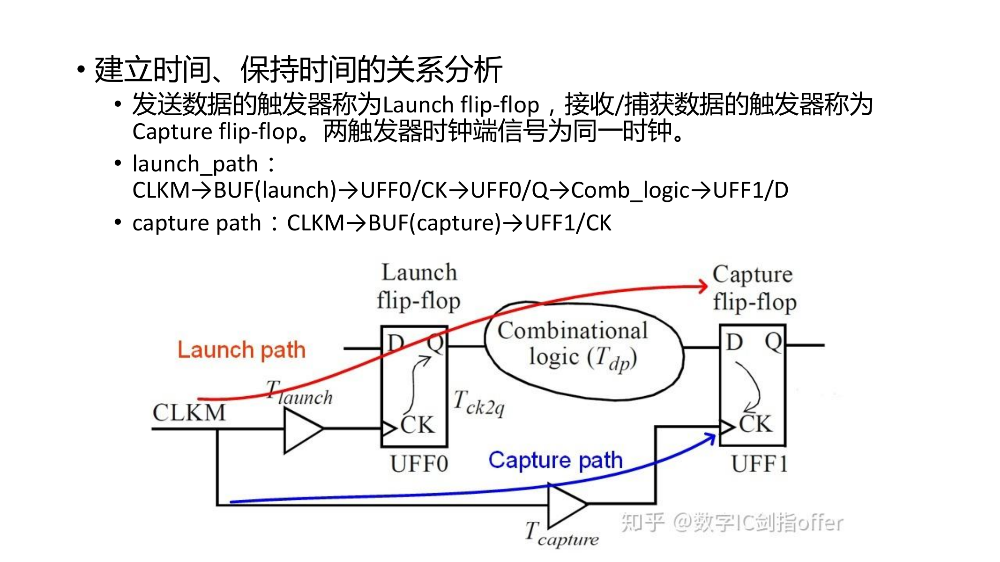

*图：Launch/Capture 路径关系示意图*

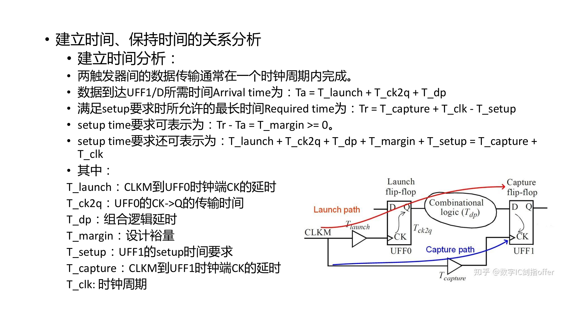

*图：建立时间分析示意图*

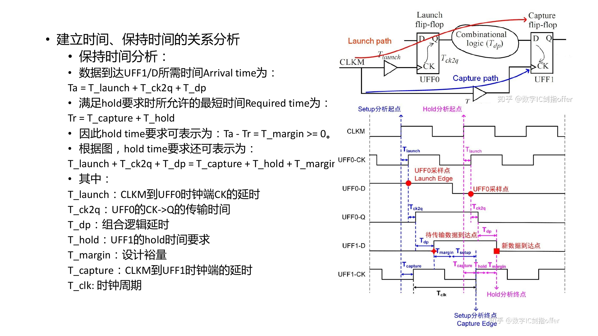

*图：保持时间分析示意图*

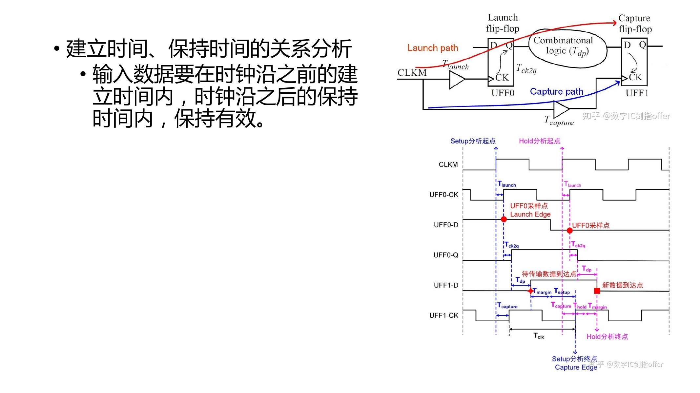

*图：建立时间与保持时间有效窗口示意图*

## 17、什么是 FPGA 设计的逻辑综合？

根据设计的逻辑功能和行为描述，在一定约束条件（面积、时序、功耗等）下，利用 EDA 工具生成逻辑门电路，实现软件描述到硬件结构的转换。

## 18、输入逻辑综合工具的三种信息包括

RTL 级描述、约束条件、工艺库。

## 19、什么是 RTL 级描述？

RTL 级描述了数字电路中寄存器之间的数据传输和逻辑操作，将电路系统视为由寄存器和连接它们的组合逻辑构成。

## 20、什么是 FPGA 设计中的约束条件？主要有哪些约束条件？

约束（constraints）：关于电路系统的设计要求，用于控制优化输出和映射工艺。

1. 环境约束：针对芯片工作环境，如电压、温度、负载和驱动等。
2. 时序约束：针对芯片工作时钟，如时钟周期、接口时序、延时等。
3. 设计规则约束：针对工艺规则，如面积、位置、最大扇入扇出、最大电容等。

## 21、面积约束和延时约束之间的关系

面积约束和延时约束是相互矛盾的关系。

## 22、分析下图逻辑综合结果的各自优缺点。

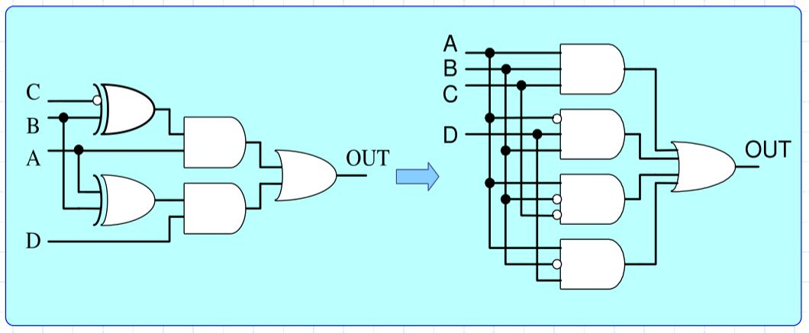

*图：逻辑综合结果对比图（一）*

**🔴 原文标红：**

- 优点：通过逻辑重组或化简减少冗余逻辑，降低门数和面积。
- 缺点：公共逻辑节点可能扇出增大，负载增加时可能影响延时。

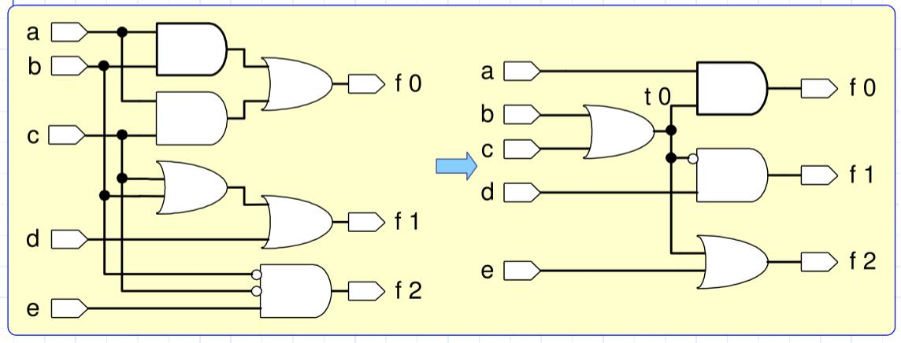

*图：逻辑综合结果对比图（二）*

**🔴 原文标红：**

- 优点：提取公共项（如 $b+c$），减少门数；若各门延时相同，各输出端时序更匹配。
- 缺点：公共项需要驱动多路后级逻辑，扇出增大时可能带来额外延时。

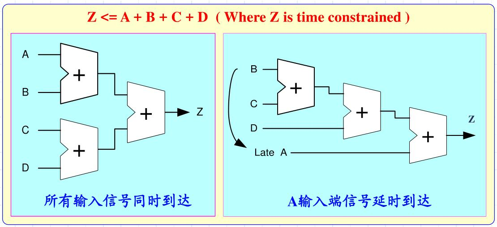

*图：延时约束下的逻辑综合结果*

**🔴 原文标红：**

- 优点：将晚到达的信号放在靠近输出端的位置，减小关键路径延时，优化时序。
- 缺点：加法树或逻辑结构被重组，可能增加连线复杂度或少量面积。

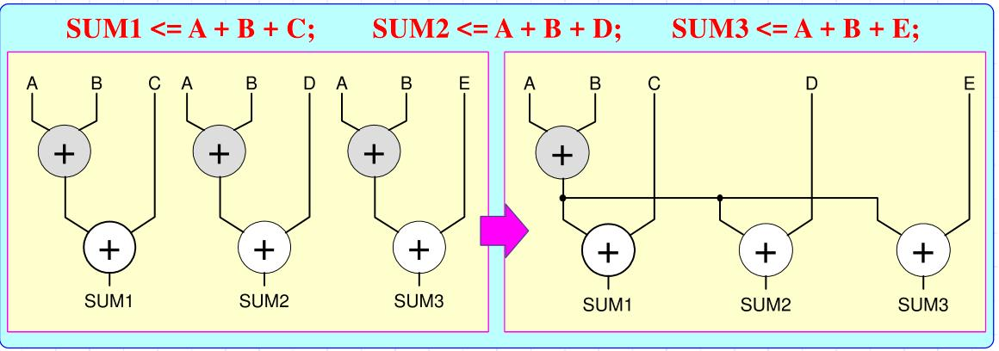

*图：资源共享相关的逻辑综合结果*

**🔴 原文标红：**

- 优点：多个表达式共享公共运算（如 $A+B$），减少重复加法器，电路面积更小。
- 缺点：共享结果节点扇出增大，可能增加该节点延时；高时序要求下可能需要额外缓冲。

## 23、时钟的不确定性有哪些？

**🔴 原文标红：**

时钟的不确定性主要包括：

- 时钟抖动（jitter）：时钟边沿相对于理想时钟边沿的时间波动。
- 时钟偏斜（skew）：同一时钟信号到达不同触发器或不同位置时产生的时间差。

在时序约束中，可使用以下命令描述这类不确定性：

```text
set_clock_uncertainty
```

图中示例为：$\mathrm{uncertainty}=\mathrm{jitter}+\mathrm{skew}$。

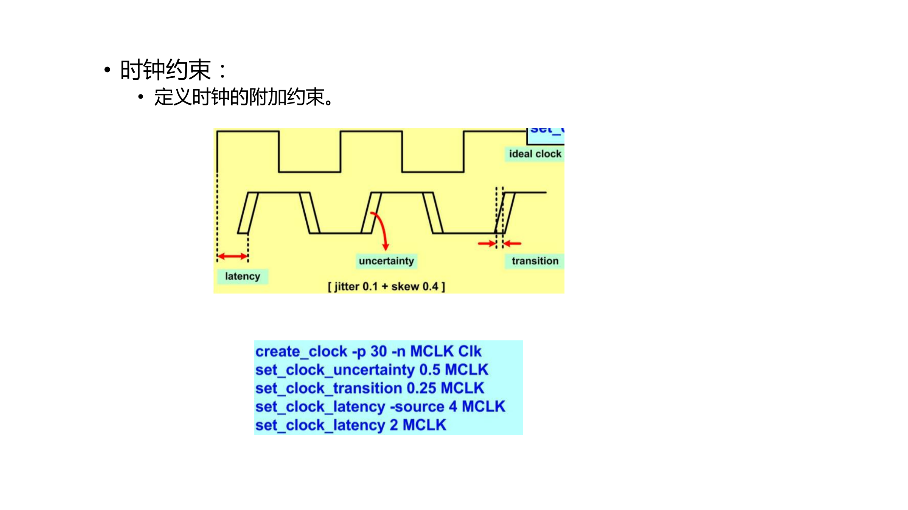

*图：时钟附加约束中的 uncertainty、jitter 与 skew*
